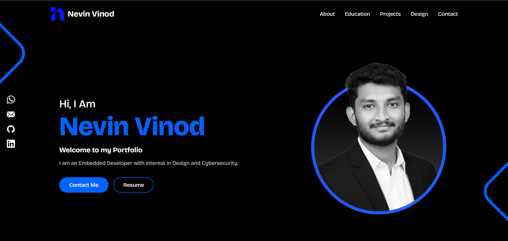

# 🌐 Portfolio-Website

A modern and responsive personal portfolio website built with **HTML**, **CSS**, and **JavaScript**, designed to showcase skills, projects, and contact information in a clean and elegant way.

---

## 🚀 Live Preview  
🔗 **[View Portfolio](https://nevinvinod.github.io/Portfolio-Website/)**  

---

## 🧠 About the Project  
This portfolio website serves as a personal hub to display professional information, featured works, and social links in an aesthetically pleasing layout.  
It focuses on simplicity, smooth animations, and fast performance for an optimal user experience.

---

## 🛠️ Tech Stack
- **HTML5** – Structure  
- **CSS3** – Styling and Layout  
- **JavaScript** – Interactivity and Animations  

---

## ✨ Features
- Fully responsive design for all screen sizes  
- Smooth animations and transitions  
- Clean, minimal, and modern interface  
- Organized structure for easy content updates  

## 📁 Folder Structure

Portfolio-Website/ 
├── index.html 
├── style.css 
├── script.js 
├── logo.svg 
├── designimg/   # Contains all 79 design images 
├── fonts/       # Custom fonts 
├── icons/       # Icon images 
└── Images/      # Other images including hero.png

## ⚙️ Deployment
This project is deployed using **GitHub Pages**.  

---

💡 *Crafted with passion and creativity — designed to reflect personal growth and skills in web development.*
